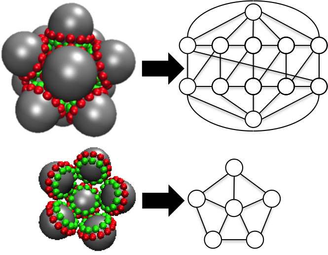
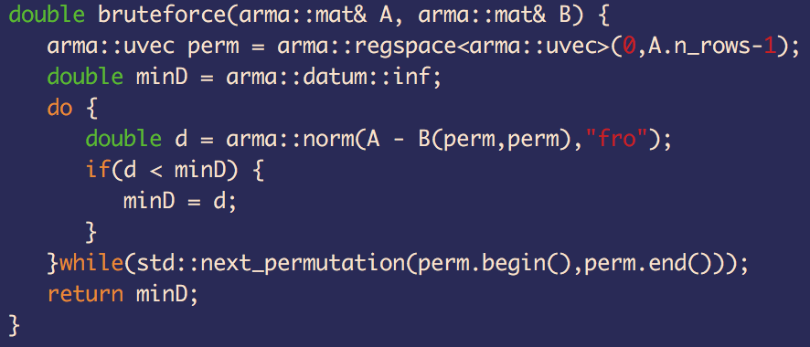
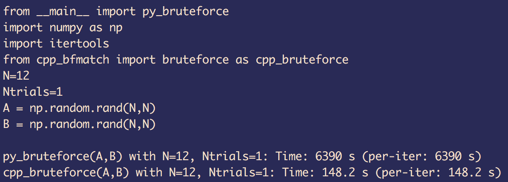

# Binding Numpy to Armadillo

## [Armadillo](http://arma.sourceforge.net/)
Armadillo is a C++11 header-only library for linear algebra. It has been developed to have a syntax very close to MATLAB in an attempt to make the transition easier. More importantly, it's been developed for speed. Delayed evaluation attempts to combine several operations to improve performance by reducing redundancy/temporaries. The goal of this library was to improve the conversion of research/prototypes codes into production.

Matrix types are defined by the `arma::mat`, while vectors are `arma::vec`. These default types are `double` precision, though alternatives exist for `float, int, uint, complex`. These datatypes have been designed to also follow STL conventions, allowing for them to be used in many functions defined in libraries like `<algorithm>`

## Armadillo Primer

#### Types:
* `arma::mat`/`arma::fmat` - double/single precision matrix type
* `arma::cx_mat`/`arma::cx_fmat` - complex double/single matrix
* `arma::umat`/`arma::imat` - unsigned/signed integer matrix

These `f/cx_/u/i` prefixes exist for the other datatypes:

* `arma::vec`/`arma::colvec` - column vectors
* `arma::rowvec` - row vector
* `arma::cube` - Cube or 3D matrix/tensor

Armadillo also provides support for CSC sparse matrix storage via the `arma::sp_mat` type.

#### Initialization

There's multiple ways to initialize a matrix/vector type. The first is through a constructor, where you can define the number of rows, number of columns, and a fill type. Not setting a fill type means that elements may exist with uninitialized values (I have been screwed by this before).

```
arma::mat A(4, 5, arma::fill::zeros);
arma::mat B(6, 5, arma::fill::one);
arma::mat C(5, 5, arma::fill::eye);
arma::mat D(3, 3, arma::fill::randu);

arma::vec E(9, arma::fill::randn);
arma::vec V(10);
```

There are also several methods to initialize a matrix/vector type:

```
arma::vec range = arma::regspace<vec>(0,9); //[0..9] inclusive
arma::vec range2 = arma::regspace<vec>(0,2,9); //[0,2,4,6,8]

// break range into N slices, N=100 is default
arma::vec linrange = arma::linspace(A, B, N); 
// generate N logarithmically spaced elements from 10^A to 10^B
arma::vec logrange = arma::logspace(A, B, N); 
```

#### Properties

```
arma::mat A(4,5);
A.n_rows // 4
A.n_cols // 5
A.n_elems // 20
```

#### Accessing Elements/Slicing

* `A(i,j)` to access the (i,j), will throw out of bounds error if not big enough matrix
* `A.col(k)`/`A.row(k)` to access a column or row a the matrix
* `A.cols(p,q)`/`A.rows(p,q)` to access the contiquous columns/rows from [p,q]
* `A(arma::span(p,q),arma::span(r,s))` to access a sub-region of the matrix for rows [p,q] and columns [r,s]
* `A(uvec_of_indices)` to access the elements given in a arma::uvec type

#### Math

* `A.t()` to get the transpose of A
* `A + B`/`A-B` - matrix add/subtract (includes scalar)
* `A * B` - matrix multiplication
* `A % B` - element-wise multiplication
* `A / B` - element-wise division
* `arma::solve(A, B)` - solve system `Ax=B`
* `arma::sum(A, dim=0)` - sum over vector or over an axis of a matrix
* `arma::accu(A)` - sum over all elements in A, equivalent to `arma::sum(arma::vectorise(A))`
* `arma::eig_sym(evals,evecs,A)`/`arma::eig_gen` - dense eigenvalue problem solver to give both eigenvalues/eigenvectors for the symmetric and general case
* `arma::eigs_sym(evals,evecs,A,k)`/`arma::eigs_gen` - sparse eigenvalue problem solver to get top k eigenvalues/eigenvectors of A

#### Other fun functions

* Sorting - `arma::sort(A)` can be done on both vectors and matrices
* Sort index ` arma::sort_index(A)` to identify sorting permutation
* Shuffling - `arma::shuffle(A)` to randomize element locations
* Unique - `arma::unique(A)` to remove duplicate elements

Lots of documentation for these functions and more exist at: [http://arma.sourceforge.net/docs.html](http://arma.sourceforge.net/docs.html)

## Converting between Numpy and Armadillo

This is a bit messier than before because we now have to deal with converting object memory between the two types. Pybind11 again provides exposure for numpy types under the **numpy.h** header. There's a bit of work we have to do to transfer between the `py::array` type of numpy and an `arma::mat` or `arma::vec`. I've provided some example bindings as part of the ArmaToNumpy codebase in this tutorial.

Let's go first between numpy's `ndarray` and Armadillo's `mat`:

```
#include <armadillo>
#include <pybind11/pybind11.h>
#include <pybind11/numpy.h>

namespace py=pybind11;
typedef py::array_t<double, py::array::f_style | py::array::forcecast> pyarr_d;

arma::mat py_to_mat(pyarr_d& pmat) {
	py::buffer_info info = pmat.request();
	arma::mat amat(reinterpret_cast<arma::mat::elem_type*>(info.ptr), info.shape[0], info.shape[1]);
	return amat;
}
```

Again this is complicated so let's go slowly:

* Armadillo stores matrices in column-major order, while numpy uses row-major order. Using the above `typedef` call we force python to cast the array in "fortran style" or column-major via the `py::array::forcecast` flag, ensuring that the form is correct for Armadillo.
* Our function takes in an instance of this `pyarr_d` type, which has a buffer_info attribute given by the following specification:

```
struct buffer_info {
    void *ptr;
    size_t itemsize;
    std::string format;
    int ndim;
    std::vector<size_t> shape;
    std::vector<size_t> strides;
};
```
* We request this buffer info from the `pyarr_d` type
* We generate a new `arma::mat` instance by casting the memory pointer given by this buffer and the shape descriptors. This cast is inherently a COPY, so we will not overwrite data from the original `py::array`

To go from Armadillo back to numpy, we construct a buffer_info object and then pass it to py::array. Note: we are now giving our memory control over to python for this object, so python should handle now be in charge of that memory (we can still write to it from C but this is prone to errors). We could of course copy our data from mat into a new buffer and pass that along, but this is just a simple example.

```
py::array_t<double> mat_to_py(arma::mat &mat) {
	py::buffer_info buffer(
		mat.memptr(),
		sizeof(double),
		py::format_descriptor<double>::format(),
		2,
		{ mat.n_rows, mat.n_cols },
		{ sizeof(double), sizeof(double) * mat.n_rows }
	);
	return py::array_t<double>(buffer);
}
```

## Example from my research

In my research, I focus on understanding the differences between particulate aggregates, with the goal of designing particles that aggregate into certain shapes. One of our prototypical systems is a hollow icosahedron formed from a species of patchy particles. To compute similarities between aggregates we abstract the particles/bonding between particles to a bonding network and use graph matching to select a minimum permutation between graph structures.

<div style="text-align:center">

</div>

The process of finding minimum permutations is *NP*-hard, as we must solve over all *N!* unique labelings. Now in my research I choose to find a pseudo-optimal permutation because **12!=479,001,600** and I want to compute pairwise distances between **~10^4** graphs (that's **2.4x10^16** permutation evaluations), requiring some greedy heuristics. For this example though, let's look at a case study on brute force graph matching.

Here's an example of Python brute force matching code:


Here it is in C++ with Armadillo:


The idea is the same, let's iterate over all possible permutations and check for the minimum Frobenius norm (elementwise 2-norm). Let's test these codes using Python's timeit function.


That's an **80-fold speedup** by switching to C++! And this is for 6-node graphs (remember I want 12-nodes for an icosahedron), as we go up the speedup goes down a bit as the time per iteration continues to rise. For 8-nodes:


which is still a **64-fold speedup**. This becomes extremely problematic again when we look at sizes of up to N=12 graphs...

